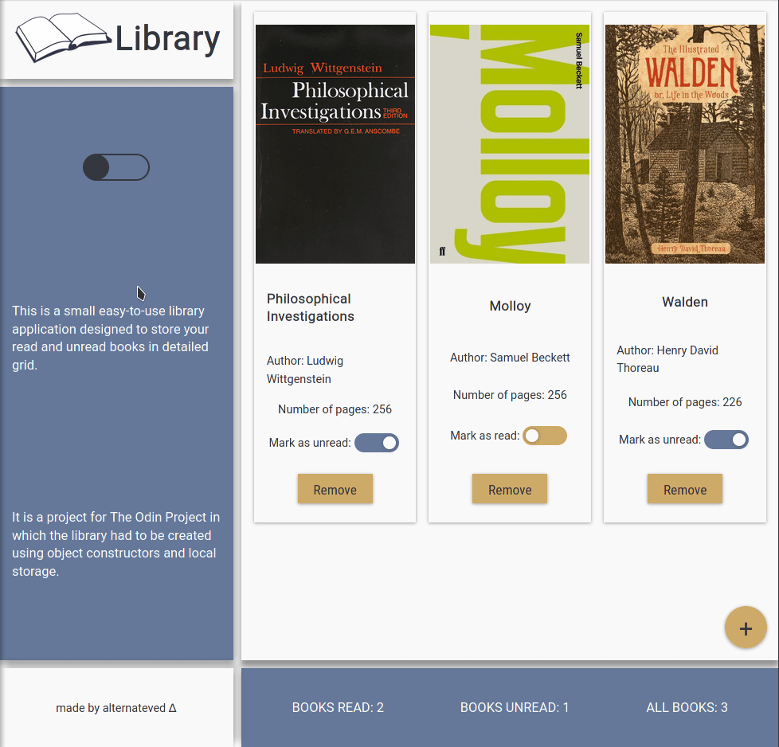

# Project: Library

Implementation of library application from [The Odin Project](https://www.theodinproject.com/lessons/library) using **JavaScript**, **HTML** and **CSS**. Data is stored in **localStorage**.

**Live preview** of the project is available [here](https://alternateved.github.io/library/).

## **Features**
* you can change page's mode to **dark mode** with toggle on the side
* you can **add a book**
* you can **add a book cover** with URL to image file
* before adding a book, you can **mark if it's already read or not**
* you can **change book status** after addition
* you can **delete a particular book**
* data is **saved** in `localStorage`
* **responsive design**: library is functional on desktop and mobile web browsers
* **dynamically displayed** statistics of submitted books

### **Side notes**
* used **HTML5 semantic elements** for better structure and readability
* used **CSS Grid** to create website's layout
* heavily inspired by Material Design
* created separate stylesheets for **light and dark mode**
* learned how to **save data to** `localStorage`
* learned how to add **favicon**
* learned about JSON stringify and parse methods which made handling the object data possible
* learned how to **create a popup form**
* deepened knowledge of creating a **color palette** to a website
* deepened knowledge of **DOM manipulation**, **HTML structure**, **CSS styling subtleties** and **JS functionality** in general

### **Tools:**
* Visual Studio Code
* Linux terminal
* Git and GitHub
* Adobe Color

### **Third party code:**
* [Google Fonts](https://fonts.google.com/)
