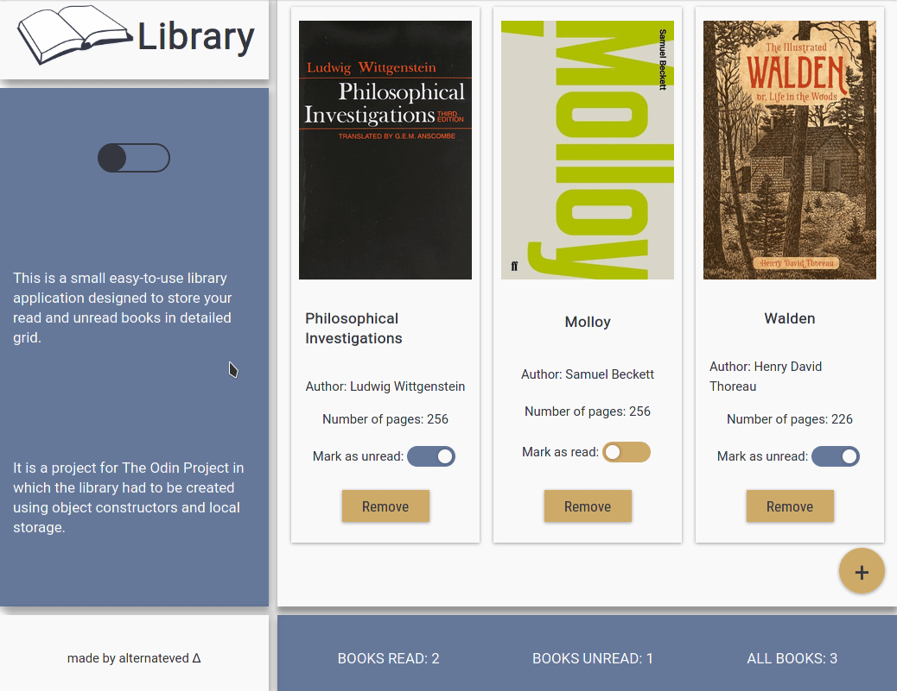

# Project: Library

Implementation of library application from [The Odin Project](https://www.theodinproject.com/lessons/library) using **JavaScript**, **HTML** and **CSS**. Data is stored in **localStorage**.

**Live preview** of the project is available [here](https://alternateved.github.io/library/).

## **Features**
* You can change page's mode to **dark mode** with toggle on the side
* You can **add a book**
* You can **add a book cover** with URL to image file
* Before adding a book, you can **mark if it's already read or not**
* You can **change book status** after addition
* You can **delete a particular book**
* Data is **saved** in `localStorage`
* **Responsive design**: library is functional on desktop and mobile web browsers
* **Dynamically displayed** statistics of submitted books

### **Side notes**
* Used **HTML5 semantic elements** for better structure and readability
* Used **CSS Grid** to create website's layout
* Heavily inspired by Material Design
* Created separate stylesheets for **light and dark mode**
* Learned how to **save data to** `localStorage`
* Learned how to add **favicon**
* Learned about JSON stringify and parse methods which made handling the object data possible
* Learned how to **create a popup form**
* Deepened knowledge of creating a **color palette** to a website
* Deepened knowledge of **DOM manipulation**, **HTML structure**, **CSS styling subtleties** and **JS functionality** in general

### **Tools:**
* Visual Studio Code
* Linux terminal
* Git and GitHub
* Adobe Color

### **Third party code:**
* [Google Fonts](https://fonts.google.com/)
